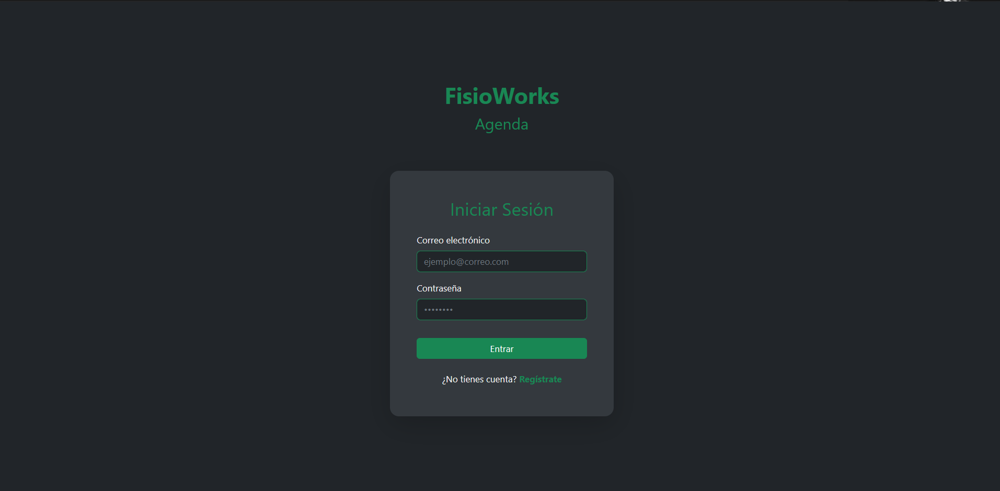
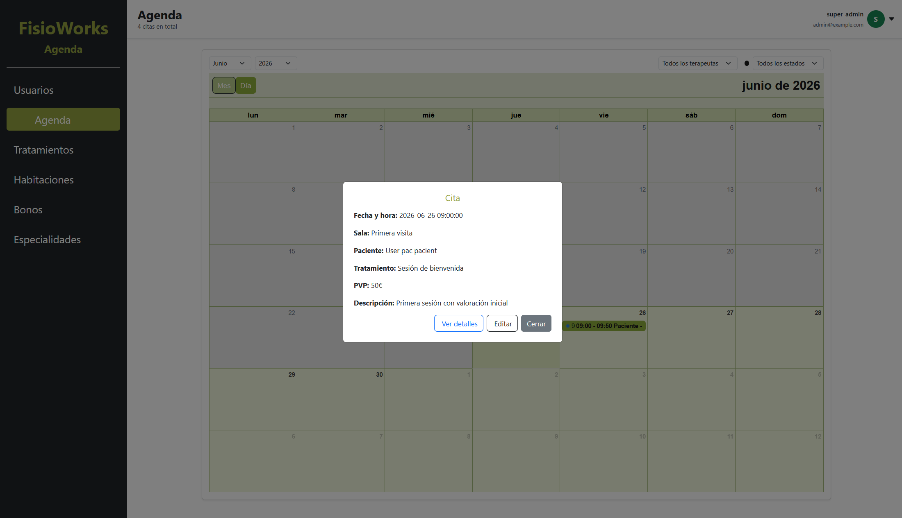
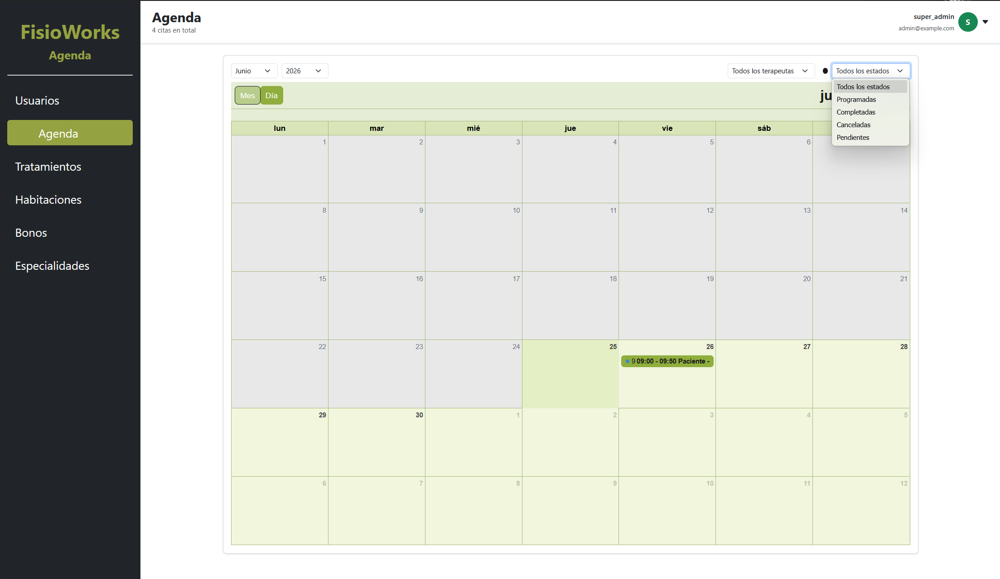
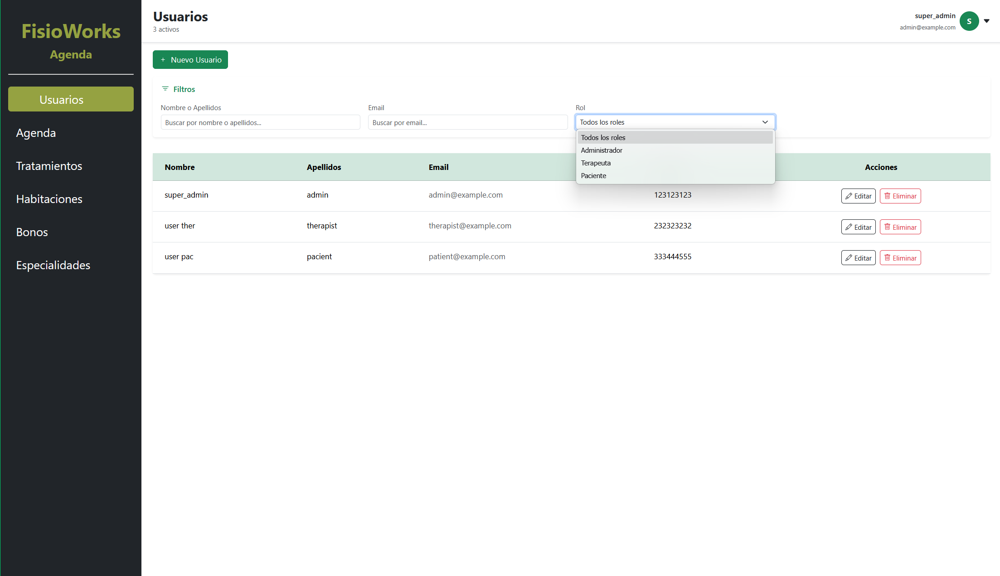
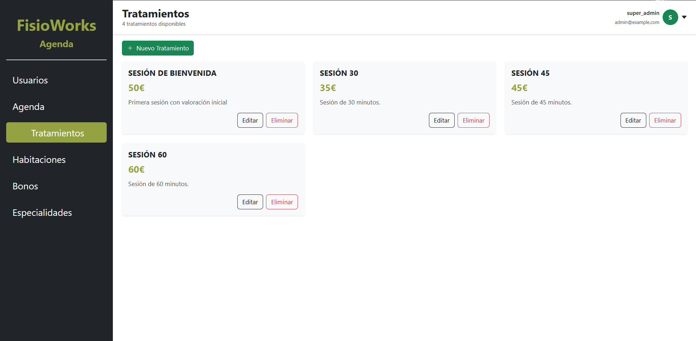
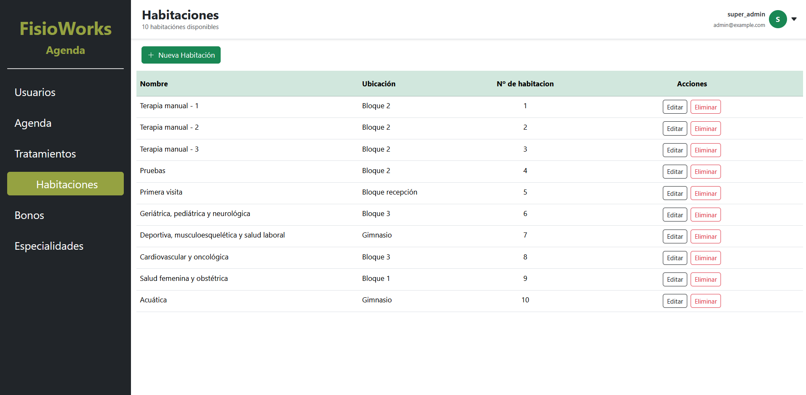
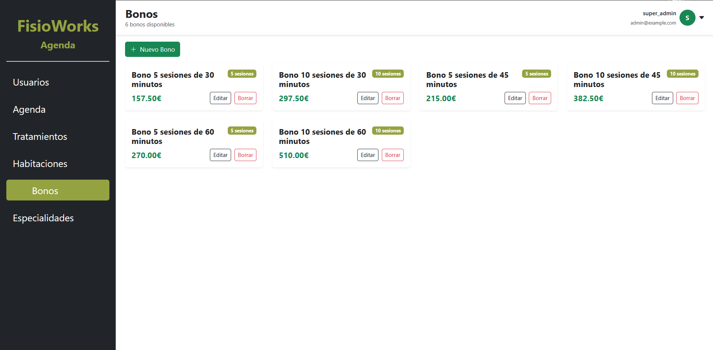

# FisioWorks — Frontend

Single Page Application for managing a physiotherapy clinic ("FisioWorks Agenda"). Built with **React 19** and **Vite**, it is the client for the [FisioWorks API](https://github.com/madawgg/FisioWorks_API) (Laravel + Sanctum) and provides role-based dashboards for administrators, therapists and patients: appointment calendar, users, treatments, rooms, vouchers, specialties and medical histories.

## Table of contents

- [Tech stack](#tech-stack)
- [Features](#features)
- [Screenshots](#screenshots)
- [Requirements](#requirements)
- [Installation](#installation)
- [Running the app](#running-the-app)
- [Configuration](#configuration)
- [Project structure](#project-structure)
- [Authentication & roles](#authentication--roles)
- [Routes](#routes)
- [API layer](#api-layer)

## Tech stack

- **React** ^19.1
- **Vite** ^7.1 (with `@vitejs/plugin-react-swc`)
- **React Router DOM** ^7.9 (`createBrowserRouter`)
- **Axios** ^1.13 (HTTP client with interceptors)
- **Bootstrap 5** + **react-bootstrap** (UI)
- **FullCalendar** ^6.1 (appointment calendar / agenda)
- **lucide-react** (icons)
- **react-select** (rich selects)
- **react-toastify** (notifications)
- **ESLint** ^9 (linting)

## Features

- **Token-based authentication** with login, registration and logout, persisted in `localStorage`.
- **Role-based UI** (admin / therapist / patient): the sidebar and available sections adapt to the user's roles.
- **Protected routes** — unauthenticated users are redirected to `/login`.
- **Appointment calendar (Agenda)** powered by FullCalendar, with create/edit/detail modals.
- Full CRUD screens for **users, treatments, rooms, vouchers (bonos), specialties and medical histories**.
- **Patient vouchers**: purchase and consumption (with a payment modal).
- Global **axios interceptors**: automatic `Bearer` token injection and automatic redirect to `/login` on `401`.
- Responsive layout with a desktop sidebar and a mobile off-canvas menu.

## Screenshots

### Login



### Agenda (calendar)





### Users



### Treatments



### Rooms



### Vouchers (bonos)



## Requirements

- Node.js (LTS recommended) & npm
- A running instance of the [FisioWorks API](https://github.com/madawgg/FisioWorks_API) (defaults to `http://localhost:8000`)

## Installation

```bash
# From the project folder
npm install
```

## Running the app

Development server (Vite, with HMR):

```bash
npm run dev
```

By default Vite serves the app at `http://localhost:5173`.

Other scripts:

```bash
npm run build     # Production build (outputs to dist/)
npm run preview   # Serves the production build locally
npm run lint      # Runs ESLint
```

## Configuration

The API base URL is defined in [`src/api/apiClient.js`](src/api/apiClient.js):

```js
const apiClient = axios.create({
  baseURL: "http://localhost:8000/api",
  headers: { "Content-Type": "application/json" },
});
```

To point the frontend to another backend, change `baseURL` there.

> For production / SPA hosting, make sure the server rewrites all routes to `index.html` (e.g. an `.htaccess` rule on Apache or a catch-all rewrite on Nginx), since routing is handled client-side by React Router.

## Project structure

```
src/
├── api/            # API layer (one module per resource, all using apiClient)
│   ├── apiClient.js    # axios instance + interceptors (token, 401 handling)
│   ├── auth.js         # login, logout, current user, roles
│   ├── user.js, patient.js, therapist.js, admin.js
│   ├── appointment.js, room.js, treatment.js, specialty.js
│   ├── bono.js, patientBono.js, medicalHistory.js, register.js
├── components/     # UI, grouped by domain
│   ├── layouts/        # MainLayout, Header, Sidebar, UserMenu, DetailLayout
│   ├── calendar/       # Agenda (FullCalendar), Appointment(s) modals
│   ├── users/, rooms/, treatments/, bonos/, specialties/, medicalHistories/
│   ├── patients/, therapists/, common/ (PaymentModal)
│   ├── ProtectedRoute.jsx, Welcome.jsx (login + register), Dashboard.jsx
├── context/        # AuthContext + AuthProvider (global auth state)
├── hooks/          # useAuth
├── utils/          # helpers (strings.js)
├── routes.jsx      # Router definition
├── App.jsx         # AuthProvider + RouterProvider
└── main.jsx        # Entry point
```

## Authentication & roles

Authentication state is managed globally through the **Context API**:

- [`AuthProvider`](src/context/AuthProvider.jsx) exposes `user`, `isAuthenticated`, `login()` and `logout()`.
- On login, the token is stored in `localStorage`, then the user profile (`GET /user`) and roles (`GET /current-user/roles`) are fetched and merged into the user object.
- On app load, an existing token is verified; an invalid token (`401`) clears the session.
- [`ProtectedRoute`](src/components/ProtectedRoute.jsx) guards the app shell and redirects guests to `/login`.

The [`Sidebar`](src/components/layouts/Sidebar.jsx) renders different navigation depending on the role:

| Role        | Sections                                                              |
|-------------|----------------------------------------------------------------------|
| Admin       | Users, Agenda, Treatments, Rooms, Vouchers, Specialties              |
| Therapist   | Users, Agenda, Treatments, Rooms, Vouchers                          |
| Patient     | Agenda, Treatments, Vouchers                                        |

## Routes

Routing is defined in [`src/routes.jsx`](src/routes.jsx). Main routes:

| Path                                      | View                | Description                          |
|-------------------------------------------|---------------------|--------------------------------------|
| `/login`                                  | Welcome             | Login & registration                 |
| `/` → `/agenda`                           | Agenda              | Appointment calendar (default)       |
| `/agenda/:id`                             | Appointment         | Appointment detail                   |
| `/appointments/:id/edit`                  | EditAppointment     | Edit appointment                     |
| `/users`, `/users/:id`, `/users/new`      | Users / User        | Users list, detail, create           |
| `/users/:id/edit`                         | EditUser            | Edit user                            |
| `/current-user/profile`                   | User                | Authenticated user's profile         |
| `/treatments`, `/treatments/:id`, `/new`  | Treatments          | Treatments CRUD                      |
| `/rooms`, `/rooms/:id`, `/rooms/new`      | Rooms               | Rooms CRUD                           |
| `/bonos`, `/bonos/:id`, `/bonos/new`      | Bonos               | Vouchers CRUD                        |
| `/patient-bonos/:id`                      | ShowPatientBono     | Patient voucher detail               |
| `/specialties`, `/specialties/:id`, `/new`| Specialties         | Specialties CRUD                     |
| `/users/:userId/medical-history/create`   | CreateMedicalHistory| Add a medical history entry          |
| `/medical-histories/:id`                  | MedicalHistory      | Medical history detail / edit        |

All routes except `/login` are wrapped in `ProtectedRoute` + `MainLayout`.

## API layer

Every resource has its own module under [`src/api/`](src/api), and they all share the configured axios instance in [`apiClient.js`](src/api/apiClient.js):

- **Request interceptor** — reads the token from `localStorage` and adds the `Authorization: Bearer <token>` header automatically.
- **Response interceptor** — on a `401`, clears the stored token/user and redirects to `/login`.

This keeps authentication and error handling centralized, so feature modules just call endpoints (`login`, `getCurrentUser`, `getUserRole`, etc.).

---

> React + Vite SPA. Requires the [FisioWorks API](https://github.com/madawgg/FisioWorks_API) running and reachable at the configured `baseURL`.
